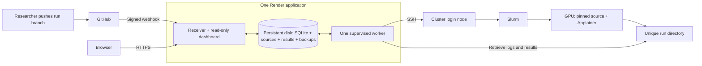

# dMaSIF job submission architecture

Revision: R6, September 30, 2026. The read-only dashboard is public with no viewing login. Run branches use experiment names with automatic pusher attribution; hosting remains the selected single Render application. The R3 specialist review remains recorded below with its original scope.
Scope: local architecture only. No service has been deployed and no cluster files or jobs have been changed for this design. Cluster paths below are proposed unless listed as observed.

## 1. Decision and first release

Build a **push-to-run service with a public, read-only experiment dashboard**. Each researcher uses their own GitHub account, pushes an experiment branch, and sees the resulting job on the website. The backend holds the SSH credential and submits through Collin's cluster account. Researchers need neither cluster credentials nor website accounts.

Start with **feature extraction**, the workflow already demonstrated on the cluster. Full model training needs a later adapter for configuration, checkpoints, resumption, and resource limits. The submission service and dashboard can support it; switching the scientific task is more than changing one command.

Keep the first release small:

- One approved repository, four allowed GitHub identities, one extraction interface.
- One demo dataset (`1STP`), one tested frozen runtime, one `quick-test` resource preset.
- One Render web service running one web process and one worker, with SQLite and files on its persistent disk.
- Two screens: run history and run details.
- One application job in flight; other accepted pushes wait in order.
- Small validated downloads and automatically refreshing status/logs.

**Every run gets a new UUID and output directory.** Repeating the same code and dataset creates another run. No application run writes into the existing shared test-output directory.

### Observed baseline

These facts come from the earlier read-only inspection.

| Item | Observed value |
| --- | --- |
| SSH / project root | `<CLUSTER_USER>@<CLUSTER_HOST>`; `<PROJECT_ROOT>` (`$WORK`) |
| Research checkout | `$WORK/dMaSIF`, clean `modern-stack`, commit `a56a69f16ea97dd3bb59d91cdcf9a298c412ce90` |
| Scheduler | Slurm, partition `<SLURM_PARTITION>`, account `<SLURM_ACCOUNT>` |
| Existing test resources | One GPU, eight CPUs, 64 GB host RAM, 15 minutes, QoS `test` |
| Extraction | `affinity/extract.py`, launched by `affinity/slurm/extract_test.sbatch` in Apptainer |
| Runtime | Mutable `$WORK/dmasif_sandbox`; a separate `$WORK/dmasif.sif` also exists |
| Demo input / existing output | `$WORK/test_pdbs/1STP.pdb`; `$WORK/feats/test_moved/1STP.npz` |
| Successful examples | Jobs `109997` and `110845` extracted on H200 and H100 |
| Existing failure mode | Job `111060` exited zero with `0 proteins to embed` because output already existed |

The batch script fixes the output directory at `feats/test_moved`. The extractor skips existing filenames, derives names from input basenames/chains, and can skip parsing failures without a failing exit code. These behaviors explain the isolation and validation requirements.

Other QoS associations exist, but v1 enables only the tested preset. The scheduler option is `--qos`; `--gos` in the README is a typo. Historical jobs remain reference evidence, not application-managed runs with invented provenance.

## 2. Researcher workflow

The designated branch convention is `runs/<experiment>`, for example `runs/pocket-v1`. Develop on ordinary branches; push a run branch when ready to spend GPU time. The signed webhook's `sender.login` identifies who pushed, and stable numeric `sender.id` values remain the authorization key. Branch names do not determine researcher identity or ownership.

Branch names are shared within the research repository. Use distinct experiment names for independent work. Any approved researcher may push to the same run branch; each qualifying push is attributed to its actual sender and receives a new run UUID and output directory. Researchers may include a username in an experiment name for convenience, but the application never interprets it as identity.

Copy this file to `experiments/run.yaml`:

```yaml
schema_version: 1
job_type: dmasif_extract
dataset_id: demo-1stp-v1
preset_id: quick-test
seed: 0
repeat_id: first-run
```

For a first experiment, choose an experiment name, commit the intended code and configuration, and push:

```bash
git switch -c runs/pocket-v1
git add experiments/run.yaml affinity/extract.py
git commit -m "Run pocket-v1 feature extraction"
git push -u origin HEAD
```

Only committed changes are submitted. The repository quickstart supplies the deployed dashboard URL and operator contact. The run appears on history without a website submission form.

A push creates **one run for its final commit**, even if it contains several commits. Creating a run branch can trigger a run. A force push can create a new run but cannot rewrite old history. Every qualifying push triggers, including documentation-only pushes to a run branch; there is no changed-file filter in v1.

To repeat, change `repeat_id`, commit, and push. This creates a new run and directory; it does not overwrite or resume the old run. There are no retry attempts within a run in v1.

Dataset IDs identify operator-maintained immutable manifests. Initially only `demo-1stp-v1` is enabled. Add measured, bounded subsets later. Researchers do not type arbitrary cluster paths or upload files through the website.

Display `angela / pocket-v1 / a56a69f / run-0042`, with the full branch/SHA on details. UUIDs are the real identifiers. Usernames, branch names, and short SHAs are never used directly as filesystem paths.

## 3. Components and trust boundaries



Deploy one paid Render web service outside the cluster: FastAPI, server-rendered HTML, modest JavaScript polling, and a Python worker inside one Docker container. The selected starting size is one CPU, 2 GB RAM, and a 10-GB persistent disk; review usage as retained source history grows. Render supplies HTTPS. There is no separate database service, background-worker service, proxy, or GitHub Pages frontend. The application needs outbound SSH and repository access, but no GPU or PyTorch. No persistent application service runs on the cluster login node.

`dmasif-console serve` supervises the web and worker processes, forwards termination, and exits on unexpected child failure so Render can restart the service. Health includes worker-process liveness; the dashboard separately reports stale cluster monitoring. Both processes use `/var/data/state`; local rotating backups use `/var/data/backups`. Keep exactly one instance. A deployment briefly interrupts the dashboard; submitted cluster jobs continue and monitoring reconciles after restart. The runtime disk is unavailable to Render one-off jobs and pre-deploy commands, so operator recovery uses the live service's Shell. [Render persistent disks](https://render.com/docs/disks)

Use SQLite WAL, short transactions, foreign keys, and a busy timeout. Enforce one worker with a process-lifetime OS file lock on the persistent local volume. Run states provide the durable queue. No Redis, distributed queue, lease framework, or separate frontend service is needed. WAL requires a same-host database, not a shared network filesystem. [SQLite WAL](https://www.sqlite.org/wal.html)

Keep allowed repository/actor IDs, dataset manifests, runtime release, resource preset, caps, and operator contact in private operator configuration. Retain its revisions in approved private operator storage and snapshot resolved settings into each run so later configuration edits cannot change accepted work. No registry-management UI is needed.

Use a small separate infrastructure repository for the service; the lab's research fork based on `modern-stack` supplies experiment code. The Render Blueprint selects the infrastructure `main` branch and disables automatic deployments and preview environments. Operators manually deploy reviewed infrastructure revisions. A research push cannot deploy changes to the application's service. Never execute research setup scripts on that host. A deployed adapter controls preparation, scheduler options, invocation, and validation.

Render secret files supply the SSH key, verified host entry, private operator configuration, and optional repository-read token. The webhook secret is entered in Render's environment settings; the Blueprint contains no secret values. The image's explicit build-context allowlist excludes secret files, including copies Render adds during builds. Use batch SSH, strict host-key verification, bounded timeouts, and no agent forwarding. Credentials never enter Git, source archives, logs, browser responses, or job directories. [Render secret files](https://render.com/docs/configure-environment-variables#secret-files), [Docker build secrets](https://render.com/docs/docker)

**The single Render service is one backend trust boundary.** The web and worker share a service and OS user. The key is hidden from browser clients, but is accessible to backend code and trusted Render administrators. A web-process compromise can therefore expose the credential. This consciously replaces R3's separate-container credential boundary in exchange for simpler hosting. The optional Linux Compose deployment retains separate web/worker secret mounts.

Serve dashboard pages, run APIs, logs, and result downloads publicly over HTTPS without a viewing login. The lab has chosen public visibility for run metadata and results. Keeping the GitHub repositories private protects source access, not the website; commit links still require GitHub repository access. Saved source archives and private operator state have no public download route. The webhook retains its signature, repository, and approved numeric sender checks. There are no browser write actions.

**This is trusted execution under one Unix account.** Attribution and isolated directories guard normal mistakes; they do not provide OS isolation or tamper-proof records between people/code with Collin's permissions. Containers and read-only mounts do not make this a hostile-code sandbox. Only the trusted repository and allowed researchers can submit.

## 4. Reliable triggers and attribution

Verify GitHub's HMAC signature against the unmodified body. Enforce a size limit, expected event type, and approved repository ID; source fetching uses configured repository details, not an arbitrary payload URL. Acknowledge only after committing the delivery and initial run to SQLite; prepare asynchronously. [Signature validation](https://docs.github.com/en/webhooks/using-webhooks/validating-webhook-deliveries)

Use the signed payload's `sender.id` and `sender.login` as **triggered by**. Store commit author/committer separately. Author email and branch names are not proof of who pushed. There is no branch-owner restriction: authorization checks the sender's approved numeric ID. Unknown actors, bots, and shared service accounts cannot submit in v1. Researchers must use personal GitHub identities. [Push payload](https://docs.github.com/en/webhooks/webhook-events-and-payloads#push)

Ignore non-run branches, tags, and branch deletions, recording reasons for approved-repository deliveries. Record actor/branch-policy rejections. An eligible run-branch event creates a visible run immediately, even if configuration later fails validation.

Deduplicate by configured hook identity plus delivery ID, and also by SHA-256 of the exact verified body. Redelivery or byte-identical replay with a changed delivery header maps to the original event/run. Reject a delivery ID reused with different bytes. Distinct qualifying events create distinct runs; do not deduplicate by commit alone. Retain deduplication records with history. Changing `repeat_id` in a new commit is the repeat mechanism. [Webhook best practices](https://docs.github.com/en/webhooks/using-webhooks/best-practices-for-using-webhooks)

GitHub does not automatically redeliver failed webhooks. History includes “Where is my run?” help, received-event activity, and the operator contact. If nothing arrived, say only that; the repository operator checks GitHub delivery history and requests redelivery. [Failed deliveries](https://docs.github.com/en/webhooks/using-webhooks/handling-failed-webhook-deliveries)

## 5. Small durable data model

| Table | Contents |
| --- | --- |
| `deliveries` | Hook/delivery IDs, verified body hash, relevant event fields, receipt time, decision/reason, run link |
| `runs` | UUID, actor snapshot, repository/ref/full SHA, source/config/input/runtime identities, state, capacity reservation, timings, validation report, artifact manifest/cache state |
| `scheduler_jobs` | Run UUID, cluster/job ID, raw state, exit code, scheduler timestamps, observation time; retain unexpected duplicate IDs |
| `events` | Run/delivery, time, transition or operator action, redacted reason/details |

Enforce unique delivery identity, verified payload identity, run-per-event, and cluster/job ID. Keep scheduler jobs one-to-many per run so duplicates remain visible. Store files outside SQLite and record controlled relative paths/checksums.

Preserve full commit links, actor ID/login, author metadata, original ref, force-push flag, source archive/checksum, original and resolved configuration, input manifest/checksums, seed, runtime/checkpoint/adapter hashes, and output checksums. Registry edits cannot alter these saved records. Slurm times differ from receipt and observation times; missing times stay unknown.

## 6. Exact code, data, and execution

Before waiting for GPU capacity, fetch and retain the **exact pushed full SHA**, read its configuration, and validate it. Never substitute the current branch head. If the SHA is unavailable, show preparation failure; do not run different code. Configure queued-run and source-size caps to bound local storage.

V1 accepts plain Git source: reject submodules, unresolved Git LFS pointers, unsafe archive paths/symlinks, and missing required code. Runtime/checkpoint assets are separately registered. Retain the source archive/checksum even if the remote branch is deleted.

Use a safe YAML parser and strict schema. Configuration cannot select arbitrary commands, repositories, output paths, images, checkpoint paths, or scheduler flags. The sole preset uses the observed one-GPU test allocation; `priority` is deferred.

Freeze and test the actually working Apptainer environment; do not assume the SIF matches the mutable sandbox. Record the image/checkpoint hashes, adapter version, and actual GPU/runtime details. Supply an explicit checkpoint rather than relying on the extractor's relative default.

Mount the saved source read-only at a fixed container path; execute its `affinity/extract.py` and pass that snapshot as `--repo`. Set the working directory/import paths, disable Python user-site packages, clean the environment, and prevent inherited `PYTHONPATH` or the old checkout from supplying project modules. Verify and record resolved project-module paths. Test against the installed Apptainer version and site mounts. [Environment](https://apptainer.org/docs/user/latest/environment_and_metadata.html), [bind mounts](https://apptainer.org/docs/user/latest/bind_paths_and_mounts.html)

Experiment code must preserve the supported extractor arguments and result schema. New dependencies, incompatible formats, or training require an operator-tested runtime/adapter release. Pinning records what ran; it does not make incompatible code work automatically.

Before submission, copy the small dataset into the run directory and verify checksums against its immutable manifest. Preserve names/extensions and chain selection. Precompute expected output filenames and reject duplicate samples or filename collisions.

The current extractor loads pending inputs into host RAM before GPU batching; `max_atoms` is not a host-memory limit. Launch the demo first and measure memory/time before enabling larger subsets. The full PLINDER collection must not go through this test template.

## 7. Preventing overwrites and false success

Proposed layout under `$WORK/job_console`:

```text
releases/
  sources/<source_sha256>/
  adapters/<version>/
  containers/<sha256>.sif
runs/<run_uuid>/
  request.json                       # trigger identities/hash + pinned config
  inputs.json                        # checksums, chains, expected outputs
  inputs/                            # immutable bounded copies
  submit.sbatch
  submission-intent.json
  submission-receipt.json
  submit.claim/                      # persistent exclusive submission claim
  execution.claim/                   # persistent exclusive execution claim
  logs/slurm-<job_id>.out
  logs/slurm-<job_id>.err
  jobs/<job_id>/
    raw_features/                    # extractor writes here
    published/                       # validated files only
    result-manifest.json             # committed last
    tmp/
    keops_cache/
```

Create the run directory exclusively. On recovery, verify immutable identity/manifests before continuing. Stage incomplete files under temporary names and publish atomically; unexpected contents stop preparation.

A new fixed template supplies `--out` under `runs/<run_uuid>/jobs/<SLURM_JOB_ID>/raw_features`. Do not invoke the existing test batch unchanged. Require fresh outputs and expose no `--overwrite`. Existing research checkout, scripts, and `feats/test_moved` remain untouched.

At batch start, acquire the **run-level** persistent execution claim before research code executes. Duplicate scheduler jobs and forced restarts cannot execute the same run again. Keep separate job-ID logs and duplicate evidence; do not delete or steal claims. Intentional repeats get new UUIDs. Use per-job temporary and KeOps-cache directories.

A fixed validator checks expected samples, readable NPZ files with pickle disabled, required arrays, nonempty points, compatible dimensions, and finite features. Use the adapter's declared schema, currently the supported 16-dimensional feature interface. Hash valid outputs.

Publish validated files without replacing existing files. Commit the final manifest atomically, last, on the same filesystem. Only listed valid artifacts can be served. Interrupted writes and uncommitted publication remain unavailable as completed results.

| Evidence | Outcome |
| --- | --- |
| Slurm completed, exit zero, all expected outputs valid | Succeeded |
| Exit zero, some expected outputs valid | Partial; not a successful run |
| Exit zero, no expected outputs valid | Failed |
| Nonzero exit, timeout, cancellation, OOM, node failure | Corresponding unsuccessful outcome, even if files exist |
| Terminal scheduler state but no usable final manifest | Results unavailable / needs review; never assume success |

If the process dies before validation, leave raw files unpublished for operator inspection. V1 does not automatically recover partial raw files or infer success from exit code alone.

## 8. Submission, capacity, and recovery

Use one application capacity slot. Validated runs wait FIFO by receipt order. Acquire it transactionally before cluster staging. Retain it while preparing, submitting, queued, running, validating, or resolving a possibly live submission. The cap covers application jobs only; direct jobs under Collin's account are outside it.

After all associated scheduler jobs are proven terminal and bounded result checks finish, release the slot even if missing results still need review. Only uncertainty about a potentially live submission keeps capacity reserved; artifact caching never holds the GPU slot.

Use fixed SSH operations and validated identifiers; never concatenate branch names or YAML into shell commands. The submission protocol is:

1. Persist submission intent: run UUID, manifest hashes, and unique scheduler tag.
2. A deployed remote helper exclusively creates `submit.claim`. If it exists, inspect evidence; never invoke `sbatch` again.
3. Submit once with `sbatch --parsable`, an application-generated name/comment containing the UUID, absolute log paths, `--open-mode=append`, and `--no-requeue`. Appending preserves earlier log content if the same job is forcibly restarted.
4. Atomically save the returned job ID in a remote receipt, then associate it in SQLite.
5. Poll exact job IDs; use `sacct` for completed states, times, and exit codes. Disappearance from `squeue` does not prove completion.

Render scheduler directives before submission: `#SBATCH` lines do not expand shell variables. The batch shell computes job-specific output paths after starting. Administrators can override requeue policy, so retain the execution claim alongside `--no-requeue`. [sbatch](https://slurm.schedmd.com/sbatch.html), [sacct](https://slurm.schedmd.com/sacct.html)

SSH can time out after Slurm accepted the job. Mark `SUBMISSION_UNKNOWN`, reserve capacity, and reconcile receipts plus scheduler tag, owner, time window, and run metadata. Never blindly resubmit. If several jobs match, retain all IDs and require review.

A claim alone proves neither success nor failure. If available evidence cannot resolve submission, use `NEEDS_REVIEW` and keep the reservation. An operator resolves possibly live jobs before releasing it. A restart resumes reconciliation, not submission. An old remote helper may outlive the worker, so a singleton worker does not replace the remote claim.

Safe source-download, deterministic staging, and polling retries are allowed with bounded backoff. Potentially executed `sbatch` calls are never retried. Crashed staging resumes only after identity/checksum checks.

Protected local operator commands, with no browser write API:

| Action | Behavior |
| --- | --- |
| Pause / resume submissions | Stop new scheduling while monitoring continues |
| Reconcile | Inspect claims, receipts, logs, scheduler evidence; record decision |
| Cancel | Cancel an unsubmitted run locally; otherwise verify run/owner mapping, cancel exact known job IDs, and await terminal evidence |
| Resolve ambiguity | Establish what happened; release reservation only with evidence no associated job remains live |
| Recover webhook | Repository operator checks GitHub delivery history and requests redelivery |

Do not delete claims or retry uncertain submissions. A resolved failure is repeated through a new configuration commit. Record operator identity and reason for actions. A named `operator_contact` is required before launch; researchers use it without needing cluster credentials.

## 9. Dashboard and result delivery

The unbranded overview starts with a run table and a link to the `dmasif-console` README's **Researcher workflow** section for submission instructions. Keep tutorials out of the dashboard. History has seven columns: **experiment, researcher, commit, dataset, status, received time, runtime**. Filter by researcher, status, and experiment. Link commits to GitHub and runs to details.

Details prioritize results, logs, timings, and concise run metadata. Configuration, provenance, validation, scheduler IDs, and activity remain available in collapsed sections. Show actionable failures and monitoring issues without routine success banners. Store UTC and display the viewer's timezone explicitly. Commit dates are not job dates. Runtime is blank until the job starts, elapsed while running, and end minus start after completion.

| Display | Meaning and next action |
| --- | --- |
| Checking request | Pinning source and validating configuration |
| Rejected / preparation failed | Show unsupported setting, missing source/input, or staging error and correction |
| Waiting for application slot | Accepted; another app run holds the slot |
| Preparing / submitting | Staging or contacting Slurm |
| Queued on cluster / running | Slurm-confirmed state; queue reason when available |
| Checking results | Scheduler finished; validating/retrieving evidence |
| Succeeded / partial / failed / cancelled / timed out | Verified outcome with scheduler and validation details |
| Submission uncertain / needs review | Show operator contact and whether capacity is reserved |

Show last successful status-check time and stale status when SSH is unavailable. Preserve the last known scheduler state; monitoring failure does not mean experiment failure. Avoid invented completion percentages.

The collapsed **Push activity** section retains ignored/rejected approved-repository events for diagnosing missing runs. Do not create user-visible rows for arbitrary unverified internet requests.

Poll bounded log tails while jobs run; fetch small validated results automatically after completion. Initial configurable cache caps: propose 10 MiB per result file, 50 MiB per run, 1 GiB total, to verify against the demo. Serve local cached downloads by fixed IDs, safe filenames, and escaped text; expose no filesystem-path API.

Transfer/cache failure does not change a verified scientific success. Show download pending/unavailable with reason and operator retrieval path. Oversized results stay on the cluster. Evict old local copies within the cap and label them unavailable; no general on-demand transfer queue in v1. Retain metadata. Do not automatically delete cluster results; monitor disk space and pause submissions at a configured low-space threshold.

Minimal routes: authenticated `POST /webhooks/github`; public, read-only `GET /`, `/runs/{id}`, `/api/runs`, `/api/runs/{id}`, `/api/runs/{id}/logs`, `/artifacts/{id}`. Browser polling reads local state and never triggers SSH or GPU work.

## 10. Build sequence and acceptance checks

Infrastructure repository:

```text
dmasif_console/         # receiver, pages, worker, supervision, SQLite migrations
cluster_adapter/        # fixed helpers, batch template, validation
config/                 # example allowlists, datasets, runtime, preset
tests/                  # webhook, scheduler, filesystem fixtures
docs/                   # researcher quickstart and operator runbook
deploy/                 # shared Docker image; optional Linux Compose setup
render.yaml             # selected single-service Render deployment
```

1. Build receiver, database, two screens, and a fake cluster adapter locally.
2. Implement snapshotting, unique directories, claims/receipts, validation, and caching against fixtures.
3. Before launch, create the Render service/URL and choose operator, approved repo/actors, trusted SSH host key, credentials, storage thresholds, and frozen runtime/checkpoint. Confirm delegated submission is permitted for the account and that the cluster permits SSH from Render.
4. A later authorized deployment installs the service and proposed cluster adapter/root, starting with the demo. This document authorizes no remote writes.
5. Run an authorized end-to-end demo twice, then submit as two researchers. Verify separate results, attribution, logs, and provenance before expanding scope.
6. Add measured datasets, concurrency, QoS choices, or training when needed.

Acceptance checks:

- Invalid signatures/actors cannot enqueue; redelivery and altered-header replay cannot duplicate jobs.
- Config rejection is visible; moving branches cannot substitute a different SHA.
- Container imports resolve to saved source; LFS/submodules and incompatible interfaces fail clearly.
- Repeat runs and researchers cannot share output paths; within-dataset filename collisions fail preflight.
- Zero-exit extractions with corrupt/missing/zero results cannot show success.
- Worker restart and SSH loss after submission reconcile without a second `sbatch`; ambiguity retains capacity.
- Duplicate execution/forced restart cannot overwrite an original run.
- Application waiting differs from Slurm queuing; stale monitoring and cache failures do not invent scientific failures.
- Pages, APIs, logs, and validated downloads work without login; public routes cannot submit/cancel or reveal credentials; logs render as text; artifact IDs cannot escape the cache.

Back up SQLite consistently with retained source archives. The Render service schedules a backup every 24 hours and keeps three automatic copies on the persistent disk. Keep configuration, manifests, release hashes, and secrets recoverable separately. An operator exports completed backups to approved private storage; off-service export is not automated in v1. Same-disk backups cannot recover loss of that disk or service.

For a restore, deploy with `DMASIF_MAINTENANCE=1` and policy submissions disabled. The supervisor runs only the maintenance web process, rejects viewer/webhook traffic, and leaves the worker stopped. Preserve the old state directory; restore into a fresh directory using Render Shell, reconcile, then leave maintenance with submissions still paused for review. A restored worker reconciles run directories and scheduler evidence before scheduling; restoring a database must not imply a fresh submission. [Render runbook](docs/render.md#backups-and-recovery)

Every remote `request.json` retains the hook/delivery identity and verified-body hash. Before resuming after a restore, rebuild and reconcile delivery/body-hash-to-run mappings from remote request/receipt evidence, including runs newer than the backup. Unresolved evidence keeps submissions paused, so redelivery cannot create another run for an already-submitted event.

## 11. Review decisions and scope control

Reliability, researcher UX, and simplicity reviewers agreed on the core workflow and requested a smaller first release. R3 removed individual web accounts, eleven-table registries, retry-attempt machinery, generic operation queues/leases, artifact-fetch queues, comparison screens, and training controls. R4 selects one Render application and local SQLite in response to the lab's hosting preference, preserving that smaller workflow. R5 simplifies run branch names; R6 removes the viewing password following the lab's decision to make results public, while retaining authenticated submissions and private backend credentials.

It keeps safeguards tied to actual or credible failures: GitHub attribution, pinned execution, unique run/job output directories, expected-output validation, replay protection, durable submission evidence, and reconciliation of ambiguous submission.

Deferred: arbitrary uploads/datasets, large artifact distribution, automatic raw-output recovery, checkpoint/resume UX, multiple workers, per-user quotas, GitHub checks, email/Slack updates, and separate Unix identities. V1 updates mean the refreshing dashboard.

Three independent specialist agents reviewed the initial design, challenged the reduced R2, and approved R3. Their decisions below describe that revision; they do not assert a review of R4's new hosting implementation.

| Review | Final decision | Main changes incorporated |
| --- | --- | --- |
| Reliability and infrastructure | APPROVE R3 | Actual source/import pinning, replay protection, ambiguous-submission capacity, restore reconciliation, preserved logs |
| Researcher UI/UX | APPROVE R3 | Copyable quickstart, two screens, curated datasets, clear waiting/error states, live logs, operator recovery |
| Simplicity and lab fit | APPROVE R3 | Four tables, one worker, configuration-file registries, new runs for repeats, bounded cache, extraction-only MVP |

The recorded consensus approves the R3 design, not a deployed implementation. R4's implementation must verify supervision, restart/reconciliation, backup consistency, maintenance recovery, and secret exclusion. Site-specific launch inputs and an authorized cluster smoke test remain required.
